# LIMITREE ERD (Entity Relationship Diagram)

## 엔티티 관계도

```mermaid
erDiagram
    %% ===== USER =====
    USERINFO {
        VARCHAR2_100 userid PK "사용자 ID"
        VARCHAR2_100 password "비밀번호"
        VARCHAR2_100 name "사용자명"
        VARCHAR2_100 email UK "이메일 (UNIQUE)"
        NUMBER_1 social "소셜 로그인 여부"
    }

    USERINFO_ROLES {
        VARCHAR2_100 userid FK "사용자 ID"
        VARCHAR2_20 roles "역할 (USER, MANAGER, ADMIN)"
    }

    %% ===== CATEGORY =====
    CATEGORY {
        NUMBER category_id PK "카테고리 ID (AUTO)"
        VARCHAR2_100 name_key "카테고리 키 (CLOTHES, TOP 등)"
        NUMBER parent_id FK "부모 카테고리 ID (Self-Join)"
        NUMBER sort_order "정렬 순서"
        VARCHAR2_1 use_yn "사용 여부 (Y/N)"
    }

    %% ===== PRODUCT =====
    PRODUCT {
        NUMBER id PK "상품 ID (SEQUENCE)"
        VARCHAR2_50 sku UK "상품 고유 코드"
        VARCHAR2_200 name "상품명"
        NUMBER_10_2 price "가격"
        NUMBER discount "할인율"
        VARCHAR2_50 offer_end "제안 종료일"
        NUMBER_1 is_new "신상품 여부"
        NUMBER rating "별점"
        NUMBER sale_count "판매 수량"
        VARCHAR2_500 category "카테고리 (쉼표 구분)"
        VARCHAR2_500 tag "태그 (쉼표 구분)"
        NUMBER stock "재고"
        VARCHAR2_2000 image "이미지 URL (쉼표 구분)"
        VARCHAR2_1500 short_description "짧은 설명"
        VARCHAR2_3500 full_description "상세 설명"
    }

    PRODUCT_VARIATION {
        NUMBER id PK "변형 ID (SEQUENCE)"
        NUMBER product_id FK "상품 ID"
        VARCHAR2_50 color "색상"
        VARCHAR2_500 image "색상별 이미지"
    }

    PRODUCT_VARIATION_SIZE {
        NUMBER id PK "사이즈 ID (SEQUENCE)"
        NUMBER p_variation_id FK "변형 ID"
        VARCHAR2_20 name "사이즈 (XS, S, M, L, XL 등)"
        NUMBER stock "해당 사이즈 재고"
    }

    %% ===== CART =====
    CART {
        VARCHAR2_100 cart_item_id PK "장바구니 아이템 ID"
        NUMBER productid FK "상품 ID"
        VARCHAR2_100 userid FK "사용자 ID"
        NUMBER quantity "수량"
        VARCHAR2_100 selectedProductColor "선택 색상"
        VARCHAR2_50 selectedProductSize "선택 사이즈"
    }

    %% ===== WISHLIST =====
    WISHLIST {
        NUMBER wishlist_id PK "위시리스트 ID (SEQUENCE)"
        NUMBER productid FK "상품 ID"
        VARCHAR2_100 userid FK "사용자 ID"
    }

    %% ===== COMPARE =====
    COMPARE {
        VARCHAR2_100 compare_item_id PK "비교 아이템 ID"
        NUMBER product_id FK "상품 ID"
        VARCHAR2_100 user_id FK "사용자 ID"
    }

    %% ===== REVIEW =====
    REVIEW {
        NUMBER review_id PK "리뷰 ID (AUTO)"
        NUMBER product_id FK "상품 ID"
        VARCHAR2_100 user_id "사용자 ID (FK 아님)"
        VARCHAR2_100 user_name "사용자명"
        NUMBER rating "별점"
        VARCHAR2_1000 content "리뷰 내용"
        DATE created_at "작성 날짜"
    }

    %% ===== ORDER =====
    ORDERS {
        NUMBER order_id PK "주문 ID (SEQUENCE)"
        VARCHAR2_100 customer_name "고객명"
        VARCHAR2_20 postal_code "우편번호"
        VARCHAR2_500 shipping_address "배송 주소"
        VARCHAR2_20 phone_number "전화번호"
        VARCHAR2_500 order_memo "주문 메모"
        TIMESTAMP order_date "주문 날짜"
        VARCHAR2_20 order_status "주문 상태"
        NUMBER_10_2 total_amount "주문 총액"
    }

    ORDER_ITEMS {
        NUMBER order_item_id PK "주문 아이템 ID (SEQUENCE)"
        NUMBER order_id FK "주문 ID"
        NUMBER product_id FK "상품 ID"
        NUMBER quantity "수량"
        NUMBER_10_2 price "주문 당시 가격"
        VARCHAR2_50 selected_product_color "선택 색상"
        VARCHAR2_50 selected_product_size "선택 사이즈"
    }

    %% ===== 관계 정의 =====
    USERINFO ||--o{ USERINFO_ROLES : "has"
    USERINFO ||--o{ CART : "has"
    USERINFO ||--o{ WISHLIST : "has"
    USERINFO ||--o{ COMPARE : "has"

    CATEGORY ||--o{ CATEGORY : "has children"

    PRODUCT ||--o{ PRODUCT_VARIATION : "has"
    PRODUCT_VARIATION ||--o{ PRODUCT_VARIATION_SIZE : "has"

    PRODUCT ||--o{ CART : "in"
    PRODUCT ||--o{ WISHLIST : "in"
    PRODUCT ||--o{ COMPARE : "in"
    PRODUCT ||--o{ REVIEW : "has"
    PRODUCT ||--o{ ORDER_ITEMS : "in"

    ORDERS ||--o{ ORDER_ITEMS : "contains"
```



## 테이블 요약

| 테이블명 | 설명 | PK 생성 전략 |
|---------|------|-------------|
| USERINFO | 사용자 정보 | userid (String) |
| USERINFO_ROLES | 사용자 역할 (ElementCollection) | - |
| CATEGORY | 카테고리 (계층 구조) | IDENTITY |
| PRODUCT | 상품 정보 | SEQUENCE (PRODUCT_SEQ) |
| PRODUCT_VARIATION | 상품 변형 (색상) | SEQUENCE (PRODUCT_VARIATION_SEQ) |
| PRODUCT_VARIATION_SIZE | 상품 사이즈별 재고 | SEQUENCE (PRODUCT_VARIATION_SIZE_SEQ) |
| CART | 장바구니 | cart_item_id (String) |
| WISHLIST | 위시리스트 | SEQUENCE (wishlist_seq) |
| COMPARE | 상품 비교 | compare_item_id (String) |
| REVIEW | 상품 리뷰 | IDENTITY |
| ORDERS | 주문 | SEQUENCE (ORDER_SEQ) |
| ORDER_ITEMS | 주문 아이템 | SEQUENCE (ORDER_ITEM_SEQ) |

## 삭제된 테이블 (기존 ERD 대비)

기존 `.erd` 파일에 있었지만 현재 backend에서 사용하지 않는 테이블:

- ~~order_item~~ → `ORDER_ITEMS`로 대체
- ~~delivery~~ - 배송 테이블 미사용
- ~~delivery_info~~ - 배송 정보 테이블 미사용
- ~~BOARD~~ - 게시판 테이블 미사용
- ~~product_option~~ → `PRODUCT_VARIATION`, `PRODUCT_VARIATION_SIZE`로 대체

## 주요 변경사항

1. **상품 옵션 구조 개선**
   - 기존: `product_option` (op1, op2, op3, op4)
   - 변경: `PRODUCT_VARIATION` (색상) → `PRODUCT_VARIATION_SIZE` (사이즈별 재고)

2. **주문 구조 단순화**
   - 기존: `orders` + `order_item` + `delivery` + `delivery_info`
   - 변경: `ORDERS` (배송 정보 포함) + `ORDER_ITEMS`

3. **사용자 역할 분리**
   - `USERINFO_ROLES` 테이블로 역할 관리 (ElementCollection)

4. **Compare 기능 추가**
   - 상품 비교 기능을 위한 `COMPARE` 테이블 추가

## 관계 요약

```
User (1) ──→ (N) Cart, Wishlist, Compare

Product (1) ──→ (N) ProductVariation (1) ──→ (N) ProductVariationSize
        ├──→ (N) Cart
        ├──→ (N) Wishlist
        ├──→ (N) Compare
        ├──→ (N) Review
        └──→ (N) OrderItem

Order (1) ──→ (N) OrderItem ──→ (1) Product

Category (1) ──→ (N) Category (Self-Join, 계층 구조)
```
